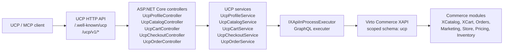

# Virto Commerce UCP Module

Модуль Virto Commerce UCP предоставляет HTTP API для Universal Commerce Protocol поверх существующих возможностей Virto Commerce Platform.

Модуль открывает публичные UCP endpoints для discovery, catalog, cart, checkout handoff и order tracking операций. Запросы преобразуются в in-process вызовы Virto Commerce XAPI и сервисов платформы без отдельного HTTP hop внутри platform process.

## Overview

`Virtocommerce.UCP` - это protocol adapter module. Он не заменяет Catalog, Cart, Orders, XAPI или Store модули. Модуль предоставляет компактный UCP-oriented HTTP surface для внешних клиентов и MCP tools, а commerce behavior делегирует существующим Virto Commerce modules.

Текущая реализация покрывает:

- UCP discovery profile: `/.well-known/ucp`.
- Catalog search через XCatalog GraphQL, выполняемый in-process.
- Product detail lookup через XCatalog GraphQL, выполняемый in-process.
- Cart assembly через XCart GraphQL: create, buyer-scoped list, get, full-state update.
- Checkout snapshot и hosted handoff без адреса через stateless DataProtection token.
- Order tracking через Orders module services: lookup по order id/number или cart id после handoff.
- Structured UCP errors.
- Buyer context propagation из HTTP headers.
- Planned/stub endpoint для checkout update.

Канонические публичные UCP endpoints публикуются без префикса `/api`. Единственный `/api` route, оставленный намеренно, это internal smoke endpoint.

## Module Structure

| Project | Назначение |
| --- | --- |
| `Virtocommerce.UCP.Core` | Protocol models, service contracts, module constants, options, errors. |
| `Virtocommerce.UCP.Data` | Module data project scaffold; domain storage model пока не используется. |
| `Virtocommerce.UCP.Data.SqlServer` | SQL Server provider marker. |
| `Virtocommerce.UCP.Data.MySql` | MySQL provider marker. |
| `Virtocommerce.UCP.Data.PostgreSql` | PostgreSQL provider marker. |
| `Virtocommerce.UCP.ExperienceApi` | XAPI schema marker для модуля. |
| `Virtocommerce.UCP.Web` | Module entry point, controllers, services, DI registrations. |
| `Virtocommerce.UCP.Tests` | Unit tests для profile, catalog и cart behavior. |

## Architecture



### Request Flow

1. Клиент вызывает канонический UCP endpoint.
2. Controller принимает HTTP request и делегирует работу UCP service.
3. Service нормализует UCP request context: store, currency, culture, pagination и buyer headers.
4. Catalog operations преобразуются в XCatalog GraphQL queries.
5. Cart operations преобразуются в XCart GraphQL queries/mutations.
6. `IXApiInProcessExecutor` выполняет GraphQL внутри текущего platform process, без отдельного HTTP call.
7. Service мапит XCatalog, XCart и Orders data обратно в UCP response models.

Buyer delegation сейчас header-based:

- `X-Buyer-User-Id`
- `X-Buyer-Organization-Id`

Service добавляет buyer claims в principal, который используется для XAPI execution. Так B2B delegated context проходит через существующие Virto Commerce authorization и context mechanisms.

## Dependencies

Module manifest объявляет runtime dependencies:

| Module | Version |
| --- | --- |
| `VirtoCommerce.Xapi` | `3.1001.0` |
| `VirtoCommerce.XCatalog` | `3.1000.0` |
| `VirtoCommerce.XCart` | `3.1016.0` |
| `VirtoCommerce.Orders` | `3.1000.0` |
| `VirtoCommerce.Marketing` | `3.1000.0` |

Target framework: `.NET 10`.

## Configuration

Configuration читается из секции `UCP`:

```json
{
  "UCP": {
    "DefaultStoreId": "store-acme",
    "DefaultCurrency": "USD",
    "DefaultCultureName": "en-US",
    "UcpBaseUrl": "https://localhost:5001/ucp/v1",
    "HandoffTokenTtlMinutes": 15,
    "AnonymousCatalog": true
  }
}
```

Если `DefaultStoreId` не настроен, catalog requests должны передавать `context.store_id`.
Checkout handoff URL строится из Virto Commerce Store URL (`Store.Url` / `Store.SecureUrl`) для `store_id`.
`UCP:StorefrontOrigin` остаётся fallback для окружений без Store URL, а `UCP:HandoffUrlTemplate` можно использовать как explicit override.

Модуль также регистрирует platform setting `UCP.Enabled`.

## Web API

### Discovery

```http
GET /.well-known/ucp
```

Возвращает UCP profile: supported capabilities, endpoint metadata, headers, auth shape, MCP tool names и structured error codes.

### Catalog Search

```http
POST /ucp/v1/catalog/search
```

Пример request:

```json
{
  "query": "iphone",
  "context": {
    "store_id": "store-acme",
    "currency": "USD",
    "language": "en-US"
  },
  "filters": {
    "price": {
      "min": 50000,
      "max": 100000
    }
  },
  "pagination": {
    "limit": 10
  }
}
```

Цены в UCP responses и filters передаются в minor units. Например, `$700.00` представляется как `70000`.

### Product Detail

```http
GET /ucp/v1/catalog/products/{id}?store_id=store-acme&currency=USD&culture_name=en-US
```

Product response включает:

- `id`
- `code`
- `name`
- `slug`
- `image_url`
- `brand`
- `product_type`
- `price`
- `list_price`
- `availability`
- `attributes`
- `variations`

Если product не найден, endpoint возвращает structured error `product_not_found`.

### Cart Assembly

```http
POST /ucp/v1/carts
GET /ucp/v1/carts?store_id=store-acme&currency=USD&culture_name=en-US&buyer_id=user-42
GET /ucp/v1/carts/{cartId}?store_id=store-acme&currency=USD&culture_name=en-US
PUT /ucp/v1/carts/{cartId}
```

`create_cart` создаёт корзину через XCart `addItem`, затем применяет купоны через `addCoupon`.

`list_carts` - Virto extension поверх XCart `carts` query. Он требует buyer context через `X-Buyer-User-Id` или `context.buyer_id`/`buyer_id` query parameter и не возвращает общий anonymous список корзин.

Пример create request:

```json
{
  "context": {
    "store_id": "store-acme",
    "currency": "USD",
    "language": "en-US",
    "buyer_id": "user-42",
    "organization_id": "org-100"
  },
  "line_items": [
    {
      "product_id": "product-id",
      "quantity": 1
    }
  ],
  "coupons": ["SAVE10"]
}
```

`update_cart` следует UCP replacement semantics: request передаёт желаемое итоговое состояние корзины, а adapter вычисляет diff и вызывает XCart mutations:

- `addItem`
- `changeCartItemQuantity`
- `removeCartItem`
- `addCoupon`
- `removeCoupon`

Чтобы удалить позицию, нужно исключить её из `line_items` или передать существующий `line_items[].id` с `quantity: 0`.

Cart response включает:

- `id`
- `status`
- `store_id`
- `currency`
- `buyer_id`
- `organization_id`
- `line_items`
- `totals`
- `coupons`
- `continue_url`
- `messages`

Денежные значения возвращаются в minor units.

### Checkout Handoff

```http
POST /ucp/v1/checkouts
GET /ucp/v1/checkouts/{checkoutId}/payment-handlers
POST /ucp/v1/checkouts/{checkoutId}/handoff
POST /ucp/v1/internal/handoff/restore
```

Текущий checkout flow hosted-only:

- `create_checkout` создаёт checkout snapshot из cart.
- `handoff_checkout` возвращает `continue_url` с защищённым `ucp_session`.
- `continue_url` использует storefront origin из Store URL, например `https://localhost:3000/checkout?ucp_session=...`.
- `storefront_restore` валидирует `ucp_session` и возвращает cart/checkout context для storefront.
- Shipping address, billing address, shipping method и payment details завершаются в storefront checkout.

Request model уже содержит optional hints для следующего шага:

- `buyer`
- `shipping_address`
- `billing_address`
- `shipping_method_id`
- `payment_handler`
- `notes`

Сейчас эти поля сохраняются в handoff token, но не применяются к XCart. Это оставляет совместимый путь для следующего slice с address prefill и shipping method selection.

### Order Tracking

```http
GET /ucp/v1/orders/{orderId}?buyer_id=user-42&culture_name=en-US
GET /ucp/v1/orders?cart_id={cartId}&buyer_id=user-42&culture_name=en-US
```

`track_order` возвращает order status, order number, totals, line items, shipment snapshot, payment snapshot и shipment tracking поля, если они уже есть в order data.

После hosted handoff клиент обычно ещё не знает `order_id`, поэтому основной путь - lookup по исходному `cart_id`. Lookup выполняется по `CustomerOrder.ShoppingCartId` через Orders module services. Если buyer context изменился во время guest checkout, endpoint повторяет поиск без buyer filter и всё равно матчится строго по `cart_id`.

Если заказ ещё не создан storefront checkout flow или не найден среди recent orders, endpoint возвращает structured error `order_not_found`.

### Planned Endpoints

Эти routes существуют как structured `501 Not Implemented` stubs:

| Method | Path | Capability |
| --- | --- | --- |
| `PATCH` | `/ucp/v1/checkouts/{checkoutId}` | checkout |

### Internal Smoke Endpoint

```http
GET /api/ucp/internal/catalog-smoke
```

Этот endpoint предназначен только для local diagnostics и не входит в публичную UCP route surface.

## Error Model

Известные UCP error codes:

- `invalid_request`
- `missing_store_id`
- `product_not_found`
- `cart_not_found`
- `order_not_found`
- `xapi_execution_failed`
- `not_implemented`

Responses включают correlation id, если он доступен. Модуль читает `X-Correlation-Id` и fallback-ится на ASP.NET Core trace identifier.

## Build and Test

```powershell
dotnet build C:\Source\vc-modules\vc-module-u-c-p\Virtocommerce.UCP.sln
dotnet test C:\Source\vc-modules\vc-module-u-c-p\Virtocommerce.UCP.sln --no-build
```

Текущий ожидаемый статус:

- Build passes.
- Unit tests pass.
- Возможны `NU1903` warnings из provider dependency chains для `System.Security.Cryptography.Xml`.

## Installation Notes

Для local platform testing нужно устанавливать этот модуль, а не старый временный draft `vc-module-ucp`. Target module id:

```text
Virtocommerce.UCP
```

После установки стоит проверить:

1. В module list есть `Virtocommerce.UCP`.
2. `GET /.well-known/ucp` возвращает UCP profile.
3. `POST /ucp/v1/catalog/search` возвращает catalog results для настроенного store.
4. `GET /ucp/v1/catalog/products/{id}` возвращает product details или structured `product_not_found`.
5. `POST /ucp/v1/carts` создаёт XCart-backed корзину.
6. `GET /ucp/v1/carts` возвращает buyer-scoped список корзин.
7. `PUT /ucp/v1/carts/{cartId}` обновляет итоговое состояние корзины.
8. `POST /ucp/v1/checkouts` создаёт checkout snapshot.
9. `POST /ucp/v1/checkouts/{checkoutId}/handoff` возвращает hosted checkout `continue_url`.
10. После оформления на storefront `GET /ucp/v1/orders?cart_id={cartId}&buyer_id={buyerId}` возвращает order tracking snapshot.

## Roadmap

Ближайшие области реализации:

- Checkout address prefill and update.
- Full carrier-level shipment tracking events, если появится carrier integration.
- Faceted/catalog filter schema для более богатого product discovery.
- OAuth2/OIDC buyer delegation вместо header-only context.

## License

Copyright (c) Virto Solutions LTD. All rights reserved.

Licensed under the Virto Commerce Open Software License (the "License"); you
may not use this file except in compliance with the License. You may
obtain a copy of the License at

<https://virtocommerce.com/open-source-license>

Unless required by applicable law or agreed to in writing, software
distributed under the License is distributed on an "AS IS" BASIS,
WITHOUT WARRANTIES OR CONDITIONS OF ANY KIND, either express or
implied.
