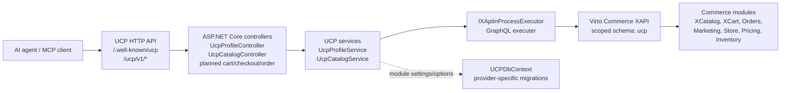

# Universal Commerce Protocol

Модуль Virto Commerce UCP предоставляет facade Universal Commerce Protocol для agentic commerce сценариев поверх существующих возможностей Virto Commerce Platform.

Модуль открывает публичные UCP endpoints для discovery и catalog операций, преобразует protocol requests в in-process вызовы Virto Commerce XAPI и сохраняет scaffold для последующей реализации cart, checkout и order flows.

## Overview

`Virtocommerce.UCP` - это protocol adapter module. Он не заменяет Catalog, Cart, Orders, XAPI или Store модули. Вместо этого модуль предоставляет компактный UCP-oriented HTTP surface для AI agents и MCP tools, а commerce behavior делегирует существующим Virto Commerce modules.

Текущая реализация покрывает:

- UCP discovery profile: `/.well-known/ucp`.
- Catalog search через XCatalog GraphQL, выполняемый in-process.
- Product detail lookup через XCatalog GraphQL, выполняемый in-process.
- Structured UCP errors.
- Buyer context propagation из HTTP headers.
- Planned/stub endpoints для cart, checkout и order tracking.

Канонические публичные UCP endpoints публикуются без префикса `/api`. Единственный `/api` route, оставленный намеренно, это internal smoke endpoint.

## Module Structure

| Project | Назначение |
| --- | --- |
| `Virtocommerce.UCP.Core` | Protocol models, service contracts, module constants, options, errors. |
| `Virtocommerce.UCP.Data` | Module DbContext scaffold. |
| `Virtocommerce.UCP.Data.SqlServer` | SQL Server migrations/provider marker. |
| `Virtocommerce.UCP.Data.MySql` | MySQL migrations/provider marker. |
| `Virtocommerce.UCP.Data.PostgreSql` | PostgreSQL migrations/provider marker. |
| `Virtocommerce.UCP.ExperienceApi` | XAPI schema marker для модуля. |
| `Virtocommerce.UCP.Web` | Module entry point, controllers, services, DI registrations. |
| `Virtocommerce.UCP.Tests` | Unit tests для profile и catalog behavior. |

## Architecture



### Request Flow

1. Agent вызывает канонический UCP endpoint.
2. Controller принимает HTTP request и делегирует работу UCP service.
3. Service нормализует UCP request context: store, currency, culture, pagination и buyer headers.
4. Catalog operations преобразуются в XCatalog GraphQL queries.
5. `IXApiInProcessExecutor` выполняет GraphQL внутри текущего platform process, без отдельного HTTP call.
6. Service мапит XCatalog data обратно в UCP response models.

Buyer delegation сейчас header-based:

- `X-Buyer-User-Id`
- `X-Buyer-Organization-Id`

Service добавляет buyer claims в principal, который используется для XAPI execution. Так B2B delegated context проходит через существующие Virto Commerce authorization и context mechanisms.

## Dependencies

Module manifest объявляет runtime dependencies:

| Module | Version |
| --- | --- |
| `VirtoCommerce.Xapi` | `3.1001.0` |
| `VirtoCommerce.XCatalog` | `3.945.0` |
| `VirtoCommerce.XCart` | `3.1016.0` |
| `VirtoCommerce.Orders` | `3.1000.0` |
| `VirtoCommerce.Marketing` | `3.1000.0` |

Target framework: `.NET 10`.

## Configuration

Configuration читается из секции `UCP`:

```json
{
  "UCP": {
    "DefaultStoreId": "store-acme",
    "DefaultCurrency": "USD",
    "DefaultCultureName": "en-US",
    "StorefrontOrigin": "https://localhost:5001",
    "UcpBaseUrl": "https://localhost:5001/ucp/v1",
    "HandoffUrlTemplate": "https://localhost:5001/checkout?ucp_session={token}",
    "AnonymousCatalog": true
  }
}
```

Если `DefaultStoreId` не настроен, catalog requests должны передавать `context.store_id`.

Модуль также регистрирует platform setting `UCP.Enabled`.

## Web API

### Discovery

```http
GET /.well-known/ucp
```

Возвращает UCP profile: supported capabilities, endpoint metadata, headers, auth shape, MCP tool names и structured error codes.

### Catalog Search

```http
POST /ucp/v1/catalog/search
```

Пример request:

```json
{
  "query": "iphone",
  "context": {
    "store_id": "store-acme",
    "currency": "USD",
    "language": "en-US"
  },
  "filters": {
    "price": {
      "min": 50000,
      "max": 100000
    }
  },
  "pagination": {
    "limit": 10
  }
}
```

Цены в UCP responses и filters передаются в minor units. Например, `$700.00` представляется как `70000`.

### Product Detail

```http
GET /ucp/v1/catalog/products/{id}?store_id=store-acme&currency=USD&culture_name=en-US
```

Product response включает:

- `id`
- `code`
- `name`
- `slug`
- `image_url`
- `brand`
- `product_type`
- `price`
- `list_price`
- `availability`
- `attributes`
- `variations`

Если product не найден, endpoint возвращает structured error `product_not_found`.

### Planned Endpoints

Эти routes существуют как structured `501 Not Implemented` stubs:

| Method | Path | Capability |
| --- | --- | --- |
| `POST` | `/ucp/v1/carts` | cart |
| `POST` | `/ucp/v1/checkouts` | checkout |
| `GET` | `/ucp/v1/checkouts/{checkoutId}/payment-handlers` | checkout |
| `POST` | `/ucp/v1/checkouts/{checkoutId}/handoff` | checkout |
| `GET` | `/ucp/v1/orders/{orderId}` | order |

### Internal Smoke Endpoint

```http
GET /api/ucp/internal/catalog-smoke
```

Этот endpoint предназначен только для local diagnostics и не входит в публичную UCP route surface.

## Error Model

Известные UCP error codes:

- `invalid_request`
- `missing_store_id`
- `product_not_found`
- `xapi_execution_failed`
- `not_implemented`

Responses включают correlation id, если он доступен. Модуль читает `X-Correlation-Id` и fallback-ится на ASP.NET Core trace identifier.

## Build and Test

```powershell
dotnet build C:\Source\vc-modules\vc-module-u-c-p\Virtocommerce.UCP.sln
dotnet test C:\Source\vc-modules\vc-module-u-c-p\Virtocommerce.UCP.sln --no-build
```

Текущий ожидаемый статус:

- Build passes.
- Unit tests pass.
- Возможны `NU1903` warnings из provider dependency chains для `System.Security.Cryptography.Xml`.

## Installation Notes

Для local platform testing нужно устанавливать этот модуль, а не старый временный draft `vc-module-ucp`. Target module id:

```text
Virtocommerce.UCP
```

После установки стоит проверить:

1. В module list есть `Virtocommerce.UCP`.
2. `GET /.well-known/ucp` возвращает UCP profile.
3. `POST /ucp/v1/catalog/search` возвращает catalog results для настроенного store.
4. `GET /ucp/v1/catalog/products/{id}` возвращает product details или structured `product_not_found`.

## Roadmap

Ближайшие области реализации:

- Cart assembly через XCart.
- Checkout creation and update.
- Hosted checkout handoff.
- Order tracking.
- Faceted/catalog filter schema для более богатого agent-side product discovery.
- OAuth2/OIDC buyer delegation вместо header-only context.

## License

Copyright (c) Virto Solutions LTD. All rights reserved.

Licensed under the Virto Commerce Open Software License (the "License"); you
may not use this file except in compliance with the License. You may
obtain a copy of the License at

<https://virtocommerce.com/open-source-license>

Unless required by applicable law or agreed to in writing, software
distributed under the License is distributed on an "AS IS" BASIS,
WITHOUT WARRANTIES OR CONDITIONS OF ANY KIND, either express or
implied.
