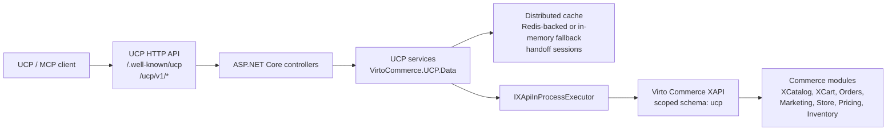

# Virto Commerce UCP Module

The Virto Commerce UCP module exposes HTTP APIs for Universal Commerce Protocol (UCP) on top of existing Virto Commerce Platform capabilities.

It provides public UCP endpoints for discovery, catalog, cart, checkout handoff, geography, and order tracking operations. Requests are adapted to in-process Virto Commerce XAPI calls and platform services without an additional HTTP hop inside the platform process.

## Overview

`VirtoCommerce.UCP` is a protocol adapter module. It does not replace the Catalog, Cart, Orders, XAPI, Store, or Marketing modules. It provides a compact UCP-oriented HTTP surface for external clients and MCP tools while delegating commerce behavior to existing Virto Commerce modules.

The current implementation covers:

- UCP discovery profile: `/.well-known/ucp`.
- Catalog search through in-process XCatalog GraphQL.
- Product detail lookup through in-process XCatalog GraphQL.
- Cart assembly through XCart GraphQL: create, buyer-scoped list, get, and full-state update.
- Checkout snapshot and hosted handoff with address prefill.
- Temporary checkout handoff sessions stored through `IDistributedCache` with TTL. Redis is recommended for production; an in-memory distributed cache fallback is registered for local and single-node deployments.
- Order tracking through Orders module services by order id, order number, or cart id after handoff.
- Geography lookup through the platform `ICountriesService`.
- Structured UCP errors.
- Buyer context propagation from HTTP headers.

Canonical public UCP endpoints are published without the `/api` prefix.

## Module Structure

| Project | Purpose |
| --- | --- |
| `VirtoCommerce.UCP.Core` | Protocol models, service contracts, module constants, options, and errors. |
| `VirtoCommerce.UCP.Data` | Provider-neutral UCP application services and integration logic. |
| `VirtoCommerce.UCP.ExperienceApi` | XAPI schema marker for the module. |
| `VirtoCommerce.UCP.Web` | Module entry point, controllers, filters, GraphQL executor, and DI registrations. |
| `VirtoCommerce.UCP.Tests` | Unit tests for discovery, catalog, cart, checkout handoff, geography, and order tracking behavior. |

The module does not define a UCP database model and does not run module database migrations.

## Architecture



## Request Flow

1. A client calls a canonical UCP endpoint.
2. The controller accepts the HTTP request and delegates work to a UCP service.
3. The service normalizes UCP request context: store, currency, culture, pagination, and buyer headers.
4. Catalog operations are translated to XCatalog GraphQL queries.
5. Cart operations are translated to XCart GraphQL queries and mutations.
6. `IXApiInProcessExecutor` runs GraphQL inside the current platform process.
7. The service maps XCatalog, XCart, Orders, Store, and platform dictionary data back to UCP response models.

Buyer delegation is header-based:

- `X-Buyer-User-Id`
- `X-Buyer-Organization-Id`

The service adds buyer claims to the principal used for XAPI execution, so delegated B2B context flows through existing Virto Commerce authorization and context mechanisms.

## Dependencies

The module manifest declares these runtime dependencies:

| Module | Version |
| --- | --- |
| `VirtoCommerce.Xapi` | `3.1001.0` |
| `VirtoCommerce.XCatalog` | `3.1000.0` |
| `VirtoCommerce.XCart` | `3.1016.0` |
| `VirtoCommerce.Store` | `3.1004.0` |
| `VirtoCommerce.Orders` | `3.1000.0` |
| `VirtoCommerce.Marketing` | `3.1000.0` |

Target framework: `.NET 10`.

## Configuration

Configuration is read from the `UCP` section:

```json
{
  "UCP": {
    "DefaultStoreId": "store-acme",
    "DefaultCurrency": "USD",
    "DefaultCultureName": "en-US",
    "UcpBaseUrl": "https://localhost:5001/ucp/v1",
    "StorefrontOrigin": "https://localhost:3000",
    "HandoffUrlTemplate": "https://localhost:3000/checkout?ucp_session={token}",
    "HandoffTokenTtlMinutes": 15,
    "AnonymousCatalog": true
  }
}
```

If `DefaultStoreId` is not configured, discovery reads open stores from the Store module. If one store is found, `/.well-known/ucp` returns it as `default_store_id`, `store`, and the only `stores[]` item. If multiple stores are found, discovery returns them in `stores[]` and the client must choose a store explicitly.

Checkout handoff URLs are built from the Virto Commerce Store URL (`Store.Url` / `Store.SecureUrl`) for the selected default store. `UCP:StorefrontOrigin` is a fallback for environments without Store URLs, and `UCP:HandoffUrlTemplate` is an explicit override.

The module registers the platform setting `UCP.Enabled`.

## Web API

### Discovery

```http
GET /.well-known/ucp
```

Returns the UCP profile: supported capabilities, default store metadata, endpoint metadata, headers, auth shape, MCP tool names, integration guidance, payment handlers, and structured error codes.

`mcp_tools` contains only callable tools. Planned operations remain in `endpoints.operations` but are not advertised as MCP tools.

### Catalog Search

```http
POST /ucp/v1/catalog/search
```

Example request:

```json
{
  "query": "iphone",
  "context": {
    "store_id": "store-acme",
    "currency": "USD",
    "language": "en-US"
  },
  "filters": {
    "price": {
      "min": 50000,
      "max": 100000
    }
  },
  "pagination": {
    "limit": 10
  }
}
```

UCP prices and price filters use minor units. For example, `$700.00` is represented as `70000`.

### Product Detail

```http
GET /ucp/v1/catalog/products/{id}?store_id=store-acme&currency=USD&culture_name=en-US
```

The product response includes id, code, name, slug, image URL, brand, product type, price, list price, availability, attributes, and variations.

If a product is not found, the endpoint returns the structured error `product_not_found`.

### Cart Assembly

```http
POST /ucp/v1/carts
GET /ucp/v1/carts?store_id=store-acme&currency=USD&culture_name=en-US&buyer_id=user-42
GET /ucp/v1/carts/{cartId}?store_id=store-acme&currency=USD&culture_name=en-US
PUT /ucp/v1/carts/{cartId}
```

`create_cart` creates a cart through XCart `addItem`, then applies coupons through `addCoupon`.

`list_carts` is a Virto extension over the XCart `carts` query. It requires buyer context through `X-Buyer-User-Id` or `context.buyer_id` / `buyer_id` and does not return a global anonymous cart list.

`update_cart` follows UCP replacement semantics: the request describes the desired final cart state, and the adapter computes the required XCart mutations:

- `addItem`
- `changeCartItemQuantity`
- `removeCartItem`
- `addCoupon`
- `removeCoupon`

To remove a line item, omit it from `line_items` or pass an existing `line_items[].id` with `quantity: 0`.

### Geography

```http
GET /ucp/v1/geography/countries?query=United%20States&limit=10
GET /ucp/v1/geography/countries/resolve?query=KZ
GET /ucp/v1/geography/countries/{countryId}/regions
```

Geography endpoints are thin adapters over the platform `ICountriesService`.

- `list_countries` returns platform countries and supports simple search by `id` or `name`.
- `resolve_country` accepts ISO2, ISO3, or platform country name and returns the platform country id, for example `KZ -> KAZ`.
- `list_regions` returns platform regions or provinces for a resolved country id.
- `city` is not resolved through a dictionary and remains a free-text checkout address field.

MCP clients should use these endpoints before checkout when country or region data comes from natural language input. This avoids guessing and preserves the existing storefront and XCart address contracts.

### Checkout Handoff

```http
POST /ucp/v1/checkouts
PATCH /ucp/v1/checkouts/{checkoutId}
GET /ucp/v1/checkouts/{checkoutId}/payment-handlers
POST /ucp/v1/checkouts/{checkoutId}/handoff
POST /ucp/v1/internal/handoff/restore
```

The current checkout flow is hosted-only:

- `create_checkout` creates a checkout snapshot from the cart.
- If the request contains `shipping_address` or `billing_address`, the module applies them to XCart before creating the snapshot.
- `update_checkout` updates address hints before payment and applies addresses to XCart.
- `handoff_checkout` returns a `continue_url` with an opaque `ucp_session`.
- `storefront_restore` validates `ucp_session`, reads the session payload from distributed cache, checks expiration, and returns cart and checkout context to the storefront.
- Shipping method and payment details are completed in storefront checkout.

`ucp_session` is an opaque random session token. The checkout/cart context, address snapshot, payment hint, and expiration timestamp are stored server-side through `IDistributedCache` with absolute expiration based on `UCP:HandoffTokenTtlMinutes`. The module registers `AddDistributedMemoryCache()` as a fallback, so handoff works without Redis in local or single-node deployments. In production multi-node deployments, the platform distributed cache should be Redis-backed so handoff restore works across nodes and sessions survive process restarts.

`shipping_address` and `billing_address` are applied to the cart through XCart `addOrUpdateCartAddress` and are also stored in the temporary handoff session payload. Before writing an address, UCP normalizes `country_code` through the platform `ICountriesService`. If the selected country has regions, `region` / `region_id` are normalized through `GetCountryRegionsAsync`.

If `shipping_address` or `billing_address` is passed to UCP, `first_name` and `last_name` are required. The module returns `invalid_request` when the recipient name is missing. For best hosted checkout UX, also pass `postal_code`, `email`, and `phone` when available.

`notes` are not treated as a delivery address. If the request contains an address only in `notes`, the response includes warning `shipping_address_not_notes`; the next `update_checkout` or `handoff_checkout` call should include a structured `shipping_address`.

Example handoff request:

```json
{
  "cart_id": "cart-1",
  "context": {
    "store_id": "store-acme",
    "currency": "USD",
    "language": "en-US",
    "buyer_id": "ucp-anonymous-123"
  },
  "buyer": {
    "email": "buyer@example.com"
  },
  "shipping_address": {
    "first_name": "Ada",
    "last_name": "Buyer",
    "line1": "1 Main St",
    "city": "Seattle",
    "region_id": "WA",
    "region": "Washington",
    "postal_code": "98101",
    "country_code": "US",
    "country_name": "United States",
    "phone": "555-0100",
    "email": "buyer@example.com"
  },
  "billing_address": {
    "first_name": "Ada",
    "last_name": "Buyer",
    "line1": "1 Main St",
    "city": "Seattle",
    "region_id": "WA",
    "region": "Washington",
    "postal_code": "98101",
    "country_code": "US",
    "country_name": "United States",
    "phone": "555-0100",
    "email": "buyer@example.com"
  },
  "payment_handler": "hosted_checkout"
}
```

### Order Tracking

```http
GET /ucp/v1/orders/{orderId}?buyer_id=user-42&culture_name=en-US
GET /ucp/v1/orders?cart_id={cartId}&buyer_id=user-42&culture_name=en-US
```

`track_order` returns order status, order number, totals, line items, shipment snapshot, payment snapshot, and shipment tracking fields when they are available in order data.

After hosted handoff, the client usually does not know `order_id` yet. The primary path is lookup by the original `cart_id`, matched against `CustomerOrder.ShoppingCartId` through Orders module services. If buyer context changed during guest checkout, the endpoint retries without buyer filters and still matches strictly by `cart_id`.

If the order has not been created yet or is not found among recent orders, the endpoint returns the structured error `order_not_found`.

## Error Model

Known UCP error codes:

- `invalid_request`
- `missing_store_id`
- `product_not_found`
- `cart_not_found`
- `order_not_found`
- `xapi_execution_failed`

Responses include correlation id when available. The module reads `X-Correlation-Id` and falls back to the ASP.NET Core trace identifier.

## Build and Test

```powershell
dotnet build C:\Source\vc-modules\vc-module-u-c-p\VirtoCommerce.UCP.sln
dotnet test C:\Source\vc-modules\vc-module-u-c-p\VirtoCommerce.UCP.sln --no-build
```

Expected status:

- Build passes.
- Unit tests pass.

## Installation Notes

For local platform testing, install this module id:

```text
VirtoCommerce.UCP
```

Recommended smoke checks after installation:

1. The module list contains `VirtoCommerce.UCP`.
2. `GET /.well-known/ucp` returns the UCP profile.
3. `POST /ucp/v1/catalog/search` returns catalog results for the configured store.
4. `GET /ucp/v1/catalog/products/{id}` returns product details or `product_not_found`.
5. `POST /ucp/v1/carts` creates an XCart-backed cart.
6. `GET /ucp/v1/carts` returns a buyer-scoped cart list.
7. `PUT /ucp/v1/carts/{cartId}` updates the final cart state.
8. `POST /ucp/v1/checkouts` creates a checkout snapshot.
9. `POST /ucp/v1/checkouts/{checkoutId}/handoff` returns a hosted checkout `continue_url`.
10. `POST /ucp/v1/internal/handoff/restore` restores the temporary handoff session.
11. `GET /ucp/v1/geography/countries/resolve?query=KZ` returns the platform country id for checkout address normalization.
12. `GET /ucp/v1/geography/countries/{countryId}/regions` returns regions when they exist in the platform dictionary.
13. After storefront checkout, `GET /ucp/v1/orders?cart_id={cartId}&buyer_id={buyerId}` returns the order tracking snapshot.

## Roadmap

Near-term implementation areas:

- Delivery and payment method selection after address-based available methods are known.
- Full carrier-level shipment tracking events when carrier integration is available.
- Faceted catalog filter schema for richer product discovery.
- OAuth2/OIDC buyer delegation instead of header-only context.

## License

Copyright (c) Virto Solutions LTD. All rights reserved.

Licensed under the Virto Commerce Open Software License (the "License"); you
may not use this file except in compliance with the License. You may
obtain a copy of the License at

<https://virtocommerce.com/open-source-license>

Unless required by applicable law or agreed to in writing, software
distributed under the License is distributed on an "AS IS" BASIS,
WITHOUT WARRANTIES OR CONDITIONS OF ANY KIND, either express or
implied.
